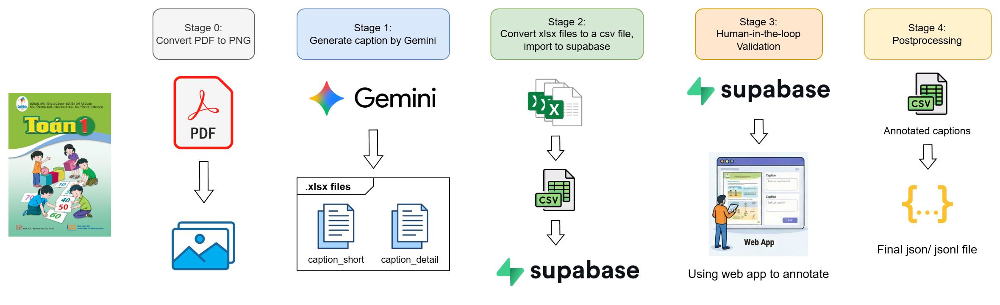

# Pipeline xây dựng dataset cho bài toán Image Captioning

Repo này triển khai pipeline **xây dựng dataset Image Captioning tiếng Việt** từ SGK tiểu học (bộ **Cánh Diều**) theo hướng **accessibility-first**: caption mô tả rõ ràng, có **2 mức: short và detail**.

> Mục tiêu: tái tạo được toàn bộ pipeline tạo dữ liệu (PDF → PNG → Gemini caption → CSV import Supabase → annotate/QC → export CSV → postprocess → JSON/JSONL cuối).

---

<p align="center">
  
</p>

## Mục lục

- [Pipeline xây dựng dataset cho bài toán Image Captioning](#pipeline-xây-dựng-dataset-cho-bài-toán-image-captioning)
  - [Mục lục](#mục-lục)
  - [1. Dataset schema (output cuối)](#1-dataset-schema-output-cuối)
  - [2. Sách trong phạm vi (10 quyển – lớp 1 đến 3 – Cánh Diều)](#2-sách-trong-phạm-vi-10-quyển--lớp-1-đến-3--cánh-diều)
  - [3. Cấu trúc thư mục](#3-cấu-trúc-thư-mục)
  - [4. Cài đặt môi trường](#4-cài-đặt-môi-trường)
    - [4.1. Option A - Cài bằng Conda (`nlp-captioning.yml`)](#41-option-a---cài-bằng-conda-nlp-captioningyml)
    - [4.2. Option B - Tạo virtual env + cài thư viện Python](#42-option-b---tạo-virtual-env--cài-thư-viện-python)
    - [4.3. Yêu cầu hệ thống (Stage 0)](#43-yêu-cầu-hệ-thống-stage-0)
  - [5. Cấu hình secrets (.env)](#5-cấu-hình-secrets-env)
  - [6. Chạy pipeline để tái tạo kết quả](#6-chạy-pipeline-để-tái-tạo-kết-quả)
    - [Stage 0: PDF → PNG](#stage-0-pdf--png)
    - [Stage 1: Gemini captioning, mỗi quyển 1 lần](#stage-1-gemini-captioning-mỗi-quyển-1-lần)
    - [Stage 2: Gộp stage1\_\*.xlsx → CSV import Supabase](#stage-2-gộp-stage1_xlsx--csv-import-supabase)
    - [Supabase - Import → Human annotate/QC → Export CSV](#supabase---import--human-annotateqc--export-csv)
    - [Stage 3: Postprocess → dataset\_final.json / jsonl](#stage-3-postprocess--dataset_finaljson--jsonl)
  - [7. metadata\_catalog.csv (bắt buộc)](#7-metadata_catalogcsv-bắt-buộc)
  - [8. Troubleshooting](#8-troubleshooting)
  - [9. Ghi chú](#9-ghi-chú)

---


## 1. Dataset schema (output cuối)

Mỗi sample (một trang ảnh) có dạng:

```json
{
  "id": "SGK_CanhDieu_DaoDuc_1_page_001",
  "image": "SGK_CanhDieu_DaoDuc_1_page_001.png",
  "metadata": {
    "Type": "SGK",
    "Collection": "Cánh Diều",
    "Title": "Đạo đức 1",
    "Grade": 1,
    "Subject": "Đạo đức",
    "Volume": "",
    "Author": "...",
    "Publisher": "..."
  },
  "caption_short": "Mô tả ngắn gọn về ảnh…",
  "caption_detail": "Mô tả chi tiết theo luồng nghe… (kèm text_in_image nếu có)",
}
```

- **`caption_short`**: mô tả ngắn gọn/chung.
- **`caption_detail`**: mô tả đầy đủ/chi tiết; nếu ảnh có chữ/bảng thì phải đưa nội dung chữ vào mô tả (inline OCR).
- **`metadata`**: tra theo [`metadata_catalog.csv`](data/stage3_inputs/metadata_catalog.csv) bằng **longest prefix match** (không dùng metadata mặc định).

Output được xuất ở:
- [`output/stage3_processed_dataset/dataset_final.json`](output/stage3_processed_dataset/dataset_final.json)
- [`output/stage3_processed_dataset/dataset_final.jsonl`](output/stage3_processed_dataset/dataset_final.jsonl)

---

## 2. Sách trong phạm vi (10 quyển – lớp 1 đến 3 – Cánh Diều)

- **Lớp 1:** Đạo đức, Tự nhiên & Xã hội, Toán  
- **Lớp 2:** Đạo đức, Tự nhiên & Xã hội, Tiếng Việt (Tập 1), Tiếng Việt (Tập 2)  
- **Lớp 3:** Đạo đức, Tự nhiên & Xã hội, Toán (Tập 1)

---

## 3. Cấu trúc thư mục

```
vn-textbook-caption-dataset
├── data
│   ├── raw/                         # PDF gốc
│   ├── processed/                   # PNG sau Stage 0
│   └── stage3_inputs/               # input cho Stage 3
│       ├── metadata_catalog.csv
│       └── supabase_export.csv
├── output
│   ├── stage1_generated_captions/   # stage1_*.xlsx (mỗi quyển 1 file)
│   ├── stage2_supabase_input/       # stage2_supabase_input.csv
│   └── stage3_processed_dataset/    # dataset_final.json/jsonl
├── prompts/                         # core + adapters
├── supabase-schema.sql              # schema table + enums
└── notebooks/ (khuyến nghị)         # Stage0/1/2/3
```

> Lưu ý về **đường dẫn tương đối**: các Stage notebook mặc định dùng `Path("../data/...")` → nên đặt chúng trong thư mục `notebooks/` và chạy notebook từ đó.  
> Nếu bạn đặt notebook ở repo root, hãy sửa lại các path trong cell `CONFIG`.

---

## 4. Cài đặt môi trường

Repo hỗ trợ 2 cách cài môi trường:

- **Option A (khuyến nghị): Conda env từ file [`nlp-captioning.yml`](nlp-captioning.yml)** *(đúng với cách nhóm đang chạy)*
- **Option B: venv + pip**

### 4.1. Option A - Cài bằng Conda (`nlp-captioning.yml`)
**File:** [nlp-captioning.yml](nlp-captioning.yml)

Tạo env và kích hoạt:

```bash
conda env create -f nlp-captioning.yml
conda activate nlp-captioning
```

Nếu bạn chạy **Jupyter Notebook/Lab**, nên đăng ký kernel:

```bash
python -m ipykernel install --user --name nlp-captioning --display-name "nlp-captioning"
```

### 4.2. Option B - Tạo virtual env + cài thư viện Python

Khuyến nghị Python **3.10+**.

```bash
python -m venv .venv
# Windows: .\.venv\Scripts\activate
source .venv/bin/activate

pip install -U pip
pip install pandas openpyxl tqdm pillow pdf2image python-dotenv google-generativeai
```

> Nếu bạn chạy notebook: cài thêm `jupyterlab`:
```bash
pip install jupyterlab
```

### 4.3. Yêu cầu hệ thống (Stage 0)
 Yêu cầu hệ thống (Stage 0)
Stage 0 dùng `pdf2image` cần **Poppler**.

- Ubuntu/Debian:
  ```bash
  sudo apt-get update
  sudo apt-get install -y poppler-utils
  ```
- macOS (Homebrew):
  ```bash
  brew install poppler
  ```
- Windows:
  - Cách 1 (khuyến nghị): tải bằng conda: 
    ```bash
    conda install -c conda-forge poppler
    ```
  - Cách 2: tải thủ công trên trang chủ của poppler rồi thêm vào PATH
  - Cách 3: chạy Stage 0 trên Colab:
    ```bash
    !apt-get install -y poppler-utils
    ```

---

## 5. Cấu hình secrets (.env)
**File:** [.env](.env)

Tạo file [`.env`](.env) ở repo root:

```env
# Gemini API Key
GEMINI_API_KEY=YOUR_KEY_HERE
```

Stage 1 sẽ load key bằng:
```python
from dotenv import load_dotenv
load_dotenv()
api_key = os.getenv("GEMINI_API_KEY")
```

---

## 6. Chạy pipeline để tái tạo kết quả

### Stage 0: PDF → PNG
- **File:** [notebooks/Stage0_pdf2png.ipynb](notebooks/Stage0_pdf2png.ipynb)
- **Input:** `data/raw/*.pdf`  
- **Output:** `data/processed/*.png`

Quy tắc đặt tên ảnh: `SGK_<Tên bộ sách>_<Tên sách>_<Lớp>_<Tap?>_<Trang>` (nếu không có tập thì bỏ Tap). Ví dụ: `SGK_CanhDieu_DaoDuc_1_page_001`

> Nếu chạy trên Colab: cần `apt-get install poppler-utils` trước khi dùng `pdf2image`.

---

### Stage 1: Gemini captioning, mỗi quyển 1 lần 
- **File:** [notebooks/Stage1_Gemini_Captioning.ipynb](notebooks/Stage1_Gemini_Captioning.ipynb)
- **Input:** `data/processed/*.png` (theo `PREFIX`) + `prompts/`  
- **Output:** `output/stage1_generated_captions/stage1_<PREFIX>.xlsx`


Cần chỉnh:
- `PREFIX = BOOK_PREFIXES[i]` (chọn quyển)

Tips:
- `NUM_IMAGES=5` để test nhanh
- `RESUME_IF_EXISTS=True` để tự resume nếu bị rate limit
- `SAVE_EVERY=10` để autosave sau mỗi 10 ảnh

---

### Stage 2: Gộp stage1_*.xlsx → CSV import Supabase
- **File:** [notebooks/Stage2_XLSX_to_Supabase_CSV.ipynb](notebooks/Stage2_XLSX_to_Supabase_CSV.ipynb)
- **Input:** `output/stage1_generated_captions/stage1_*.xlsx`  
- **Output:** [`output/stage2_supabase_input/stage2_supabase_input.csv`](output/stage2_supabase_input/stage2_supabase_input.csv)

---

### Supabase - Import → Human annotate/QC → Export CSV
1) Tạo project Supabase.
2) Mở SQL editor và chạy [`supabase-schema.sql`](supabase-schema.sql) để tạo enums + table `public.dataset`.
3) Import file [`stage2_supabase_input.csv`](output/stage2_supabase_input/stage2_supabase_input.csv) vào table `public.dataset`.
4) Annotate/QC trực tiếp trên giao diện web UI của nhóm (sửa caption, set `is_checked` = `checked`/`reviewed`, gắn `error_tags`…). Xem guideline chi tiết trong báo cáo.
5) Export table `public.dataset` ra CSV (Supabase export).

Đặt file export vào:
- [`data/stage3_inputs/supabase_export.csv`](data/stage3_inputs/supabase_export.csv)

---

### Stage 3: Postprocess → dataset_final.json / jsonl
- **File:** [notebooks/Stage3_Postprocess.ipynb](notebooks/Stage3_Postprocess.ipynb) 
- **Input:**  
  - [`data/stage3_inputs/supabase_export.csv`](data/stage3_inputs/supabase_export.csv) (CSV export từ Supabase)  
  - [`data/stage3_inputs/metadata_catalog.csv`](data/stage3_inputs/metadata_catalog.csv)
- **Output:**  
  - [`output/stage3_processed_dataset/dataset_final.json`](output/stage3_processed_dataset/dataset_final.json)
  - [`output/stage3_processed_dataset/dataset_final.jsonl`](output/stage3_processed_dataset/dataset_final.jsonl)

---

## 7. metadata_catalog.csv (bắt buộc)
- **File:** [data/stage3_inputs/metadata_catalog.csv](data/stage3_inputs/metadata_catalog.csv)
- `prefix` phải khớp prefix trong `id` (dùng longest prefix match).
- Khuyến nghị dùng encoding UTF-8-SIG để mở Excel không lỗi.

---

## 8. Troubleshooting

**(1) Lỗi path “không tìm thấy file”**  
- Chạy notebook từ đúng working directory (khuyến nghị `notebooks/`), hoặc sửa các `Path("../...")` cho phù hợp.

**(2) CSV import Supabase lỗi enum/array**  
- Stage 2 đã convert các cột array sang Postgres array literal `{}` hoặc `{"a","b"}`.  
- Kiểm tra các cột enum: `page_type`, `review_priority`, `is_checked` có đúng allowed values.

**(3) Gemini bị rate limit / lỗi mạng**  
- Bật `RESUME_IF_EXISTS=True` và để `SAVE_EVERY` nhỏ.
- Giảm `NUM_IMAGES` để test.
- Tăng `MAX_RETRY` / `BASE_DELAY_SEC` nếu cần.

---

## 9. Ghi chú
- Guideline annotation: xem `ANNOTATION GUIDELINE (Accessibility-first).md`.
- Repo này phục vụ mục đích học thuật/đồ án; hãy đảm bảo quyền sử dụng ngữ liệu theo quy định môn học/nhà trường.
